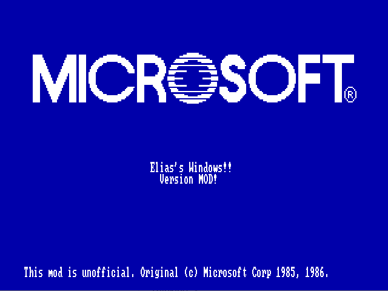

# Screenshots

Capturas de Windows 1.03 arrancando con el pipeline del proyecto.

## Capturas disponibles

### `01-elias-windows-splash.png`

Boot splash de la version mod **`elias-windows`** corriendo en DOSBox-X.

Cambios visibles:
- `Microsoft Windows / Version 1.03` -> `Elias's Windows!! / Version MOD!`
- Disclaimer honesto: "This mod is unofficial. Original (c) Microsoft Corp 1985, 1986."

El logo de Microsoft se mantiene intacto - respeta la marca registrada y deja claro que esto es un mod sobre el producto original, no una sustitucion.



## Mas capturas pendientes

Cuando arranques DOSBox-X, saca estas capturas y guarda los PNGs aqui:

### Version sin mods (vanilla)

```bash
# 1. Asegura que src/ esta limpio (sin mods)
python3 bootstrap/mod_system.py revert

# 2. Rebuild byte-exact
python3 bootstrap/build_from_source.py

# 3. Despliega built/ al IMG
bash bootstrap/deploy-to-img.sh

# 4. Arranca DOSBox-X
runtime\dosbox-x-win\mingw-build\mingw-sdl2\dosbox-x.exe -conf runtime\dosbox-win103.conf
```

Capturas a sacar:
- `01-splash-vanilla.png` - splash screen "Microsoft Windows" / "Version 1.03"
- `02-shell-vanilla.png` - MS-DOS Executive con menus "File / View / Special"
- `03-about-vanilla.png` - dialogo About de cualquier app

### Version mod elias-windows

```bash
# 1. Aplica el mod
python3 bootstrap/mod_system.py apply elias-windows

# 2. Rebuild + deploy
python3 bootstrap/build_from_source.py
bash bootstrap/deploy-to-img.sh

# 3. Arranca DOSBox-X otra vez
```

Capturas a sacar:
- `04-splash-elias.png` - splash con "Elias's Windows!!"
- `05-shell-elias.png` - MS-DOS Executive con menus "MOD! / MIO! / ZONA!!!"
- `06-about-elias.png` - dialogo About con "Elias's Windows"

### Extra (opcional)

- `07-callgraph.png` - captura del HTML interactivo (docs/analysis/callgraph.html) con el grafo
- `08-asm-source.png` - captura de un .asm en VSCode con los comentarios semanticos
- `09-vscode-tree.png` - tree de carpetas del proyecto en VSCode

## En DOSBox-X

Para capturar:
- **Ctrl + F5** = guarda BMP en la carpeta de captures de DOSBox-X
- Configura captures dir en `runtime\dosbox-win103.conf` seccion `[dosbox]` -> `captures=screenshots/raw`

Despues convierte BMP -> PNG (ej: con ImageMagick `magick *.bmp *.png`).
